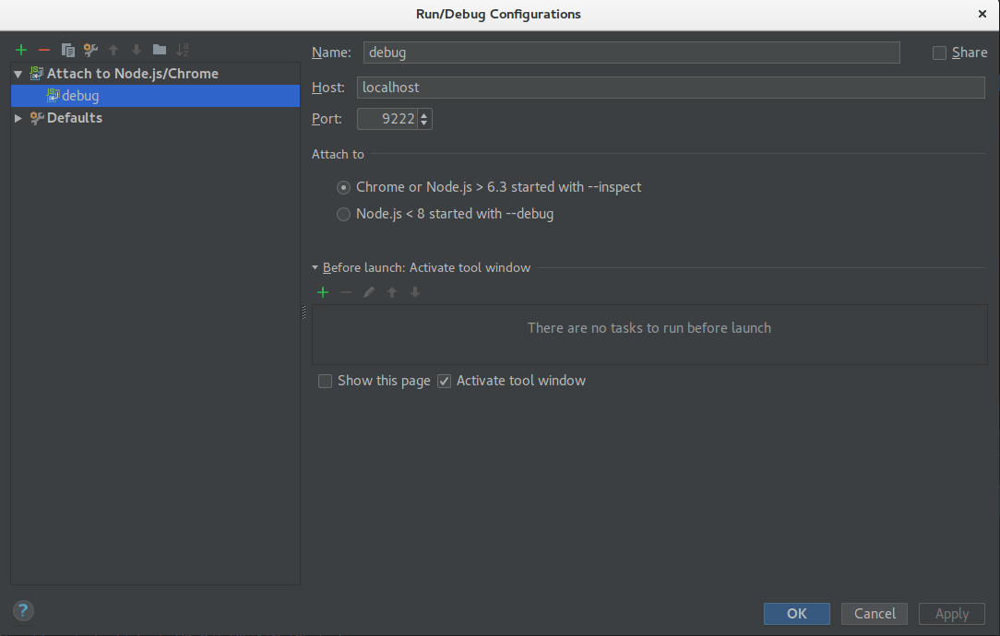

## Debug Configuration for Electron with angular-cli and Webstorm

1. Add `app.commandLine.appendSwitch('remote-debugging-port', '9222');` to main.js (in this case the electron.dev.js)
2. 
3. Start app: `npm start`
4. Close Developer Tools in browser
5. Click debug icon
